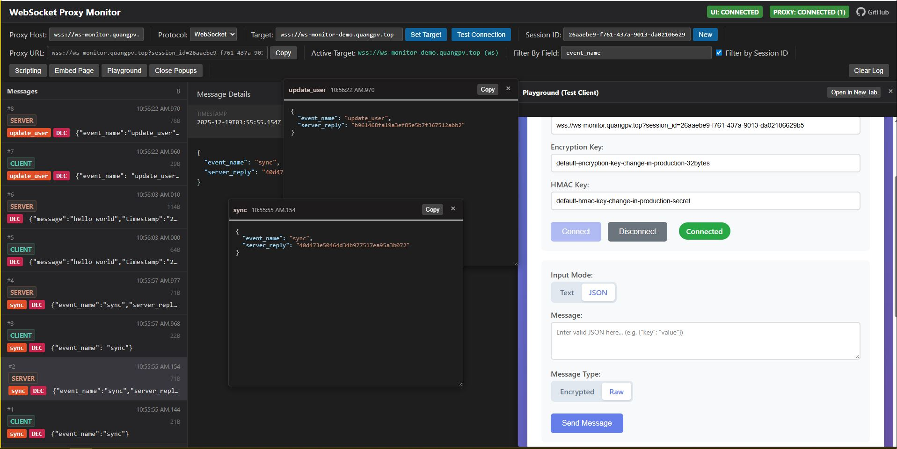
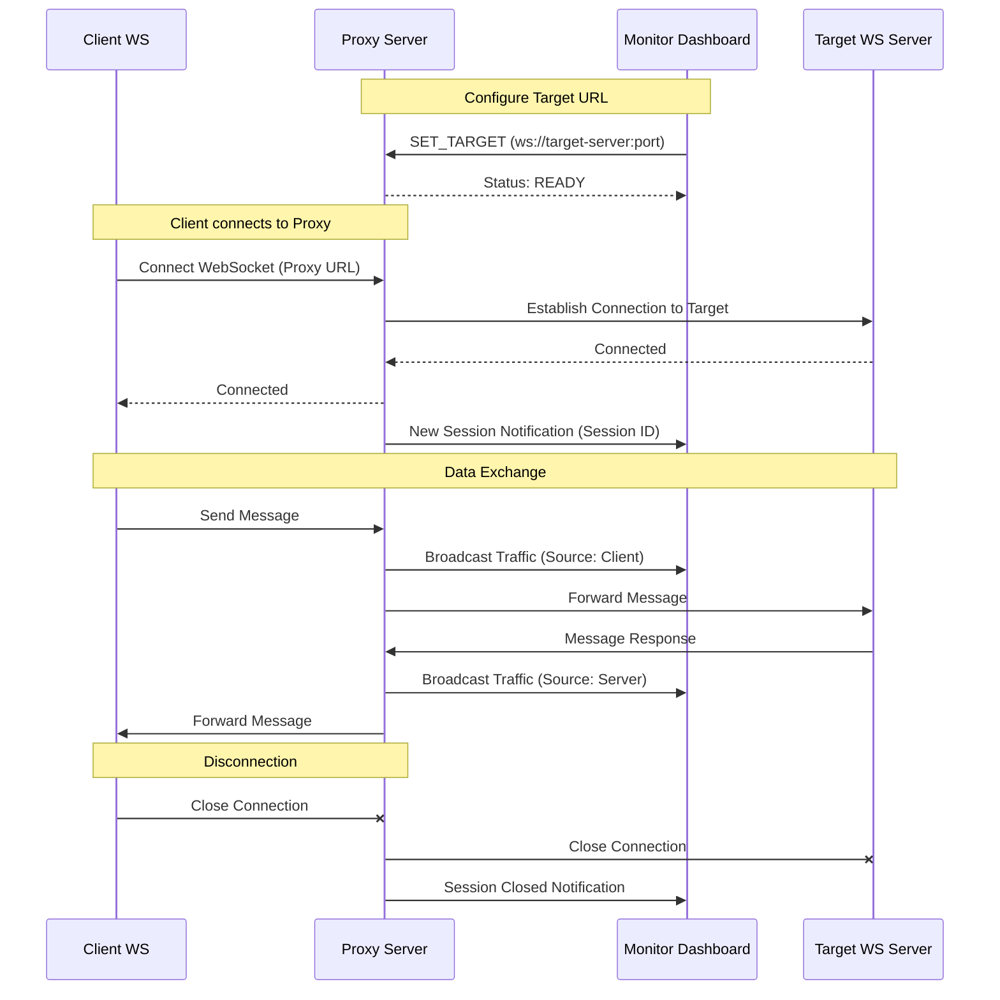

# WebSocket Proxy Monitor

A powerful tool for monitoring, debugging, and analyzing WebSocket/Socket.IO message flows between a Client and a Server.

 

## Live Demo
- **Demo Video**: [ws-monitor.quangpv.top/#demo](https://ws-monitor.quangpv.top/#demo)
- **Playground**: [ws-monitor.quangpv.top/playground](https://ws-monitor.quangpv.top/playground)

## Purpose
- **Visualize Message Flow**: Track real-time messages exchanged between client and server to debug complex logic flows.
- **Ensure Integration**: Validate correct integration with third-party services or other microservices.
- **Protocol Support**: Supports both Raw WebSocket (WS) and Socket.IO.

## Key Features
- **Session-Based Management**: Each connection is isolated into a unique session, making it easy to filter and track specific client interactions.
- **Real-Time Monitoring**: Broadcast traffic to a centralized dashboard in real-time.
- **Proxy Configuration**: Dynamically set the target WebSocket server URL via the Monitor UI.
- **Custom Message Decryption**: Write and execute custom JavaScript logic directly in the browser to decrypt or reformat encrypted payloads in real-time.
- **Embedded Sandbox**: Inject custom HTML, CSS, and JavaScript into an isolated sandbox (iframe) to build custom test clients or data visualizers directly within the monitor dashboard.
- **Stateless & Private**: The proxy does not store any messages in a database or local storage. All traffic is forwarded in real-time and exists only in memory during transmission.
- **Internal Team Collaboration**: This proxy is designed to be easily self-hosted for internal development teams.

> [!TIP]
> **Self-Hosted for Teams**: Shared monitoring infrastructure allows multiple developers to debug different flows simultaneously without interference using session-based management.

> [!IMPORTANT]
> **Data Privacy**: No data is persisted on the server. The proxy acts purely as a pipe, ensuring your sensitive debugging information stays within your control.

## System Architecture

The system acts as a "Man-in-the-Middle" proxy between the Client and the Target Server.

### Core Components:
1.  **Proxy Server (Node.js)**: 
    - Handles incoming client connections.
    - Manages concurrent connections to the Target Server.
    - Forwards bidirectional messages.
    - Maintains the global state and session registry.
2.  **Monitor Dashboard (UI)**:
    - Web interface to configure the Target URL.
    - Displays active sessions and real-time traffic.
3.  **Client WS**: Any WebSocket-capable application, connecting to the Proxy URL instead of the direct server.

### Operational Flow:
1.  **Configuration**: Set the **Target URL** via the Monitor UI.
2.  **Connection**: Client connects to the **Proxy URL**.
3.  **Session Initialization**: Proxy generates a unique Session ID for the connection pair.
4.  **Forwarding & Monitoring**:
    - Every message from Client is logged and forwarded to the Server.
    - Every response from Server is logged and forwarded back to the Client.

## Message Flow Diagram

## Quick Start

1.  **Run Proxy Server**: `yarn dev` (Default port: 8000).
2.  **Access Monitor UI**: Open `http://localhost:8000/playground`.
3.  **Set Target**: Input your actual WebSocket Server URL and click **Set**.
4.  **Connect Client**: Update your app to connect to `ws://localhost:8000`.
5.  **Monitor**: Watch real-time traffic on the dashboard.

---

Feel free to comment or clone this repo. If you find any issues, please let me know!